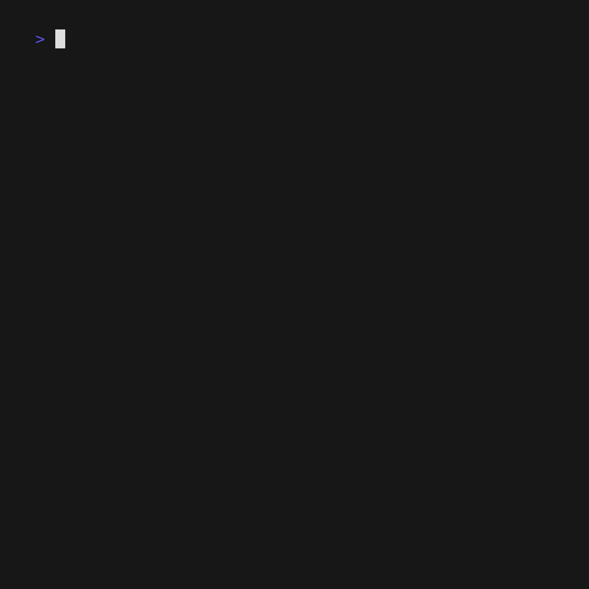
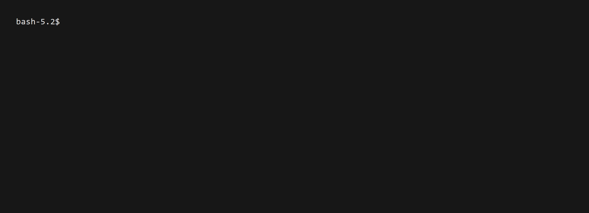
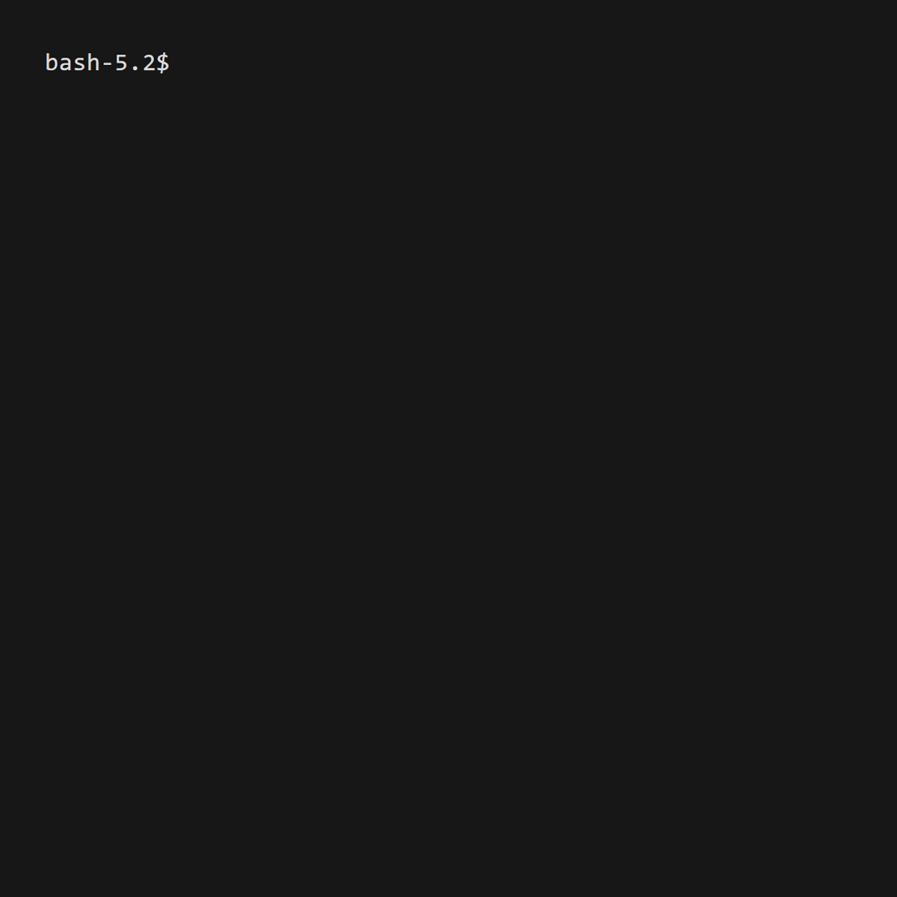

# Minepack

a fast CLI tool for managing minecraft modpacks with instance linking.

## Features

**multi-source support** - add mods from modrinth and curseforge\
**export formats** - export to `.mrpack` (modrinth) (curseforge support coming soon:tm:)\
**instance linking** - sync your modpack to a minecraft instance to quickly test stuff\
**bisect search** - easily find which mods are causing issues with a built in bisection search tool- also considers dependencies so nothing should break.\
**dependency resolution** - automatically handles mod dependencies (unless the mod creator fails to add any)\
**version management** - track modpack versions with semantic versioning, increment-based, or custom formats with automatic git integration\

## Installation

### Download Pre-built Binaries

download the latest release for your platform from [releases](https://github.com/ayeuhugyu/minepack/releases)

### Build from Source

```bash
git clone https://github.com/ayeuhugyu/minepack.git
cd minepack
go build -ldflags "-X minepack/util/version.Version=$(git describe --tags --always)"
```
(you will need to have the go language installed for this to work)

### Self-Update

keep minepack up to date automatically:

```bash
minepack selfupdate
```

## Quick Start

### 1. Initialize a new modpack



```bash
# create a new modpack project
minepack init
```

### 2. Add mods


```bash
# add mods by searching
minepack add sodium
minepack add create
```

### 3. View information about your modpack



```bash
# list all mods in your modpack
minepack list

# view some pack statistics
minepack stats
```

### 4. Export your modpack

```bash
# export as modrinth pack (.mrpack)
minepack export modrinth
```

## Advanced Usage

### Instance linking

link your modpack to Minecraft instances for automatic syncing / binary searches:



```bash
# add a linked instance
minepack link add /path/to/instance

# list all linked instances
minepack link list

# update all linked instances with current modpack
minepack link update

# filter updates by side or source
minepack link update --server-only
minepack link update --client-only
minepack link update --source modrinth
```

### Troubleshoot with bisect searching


debug mod conflicts and crashes by systematically enabling/disabling mods:

```bash
# start bisect session for a linked instance
minepack link bisect /path/to/.minecraft

# get the next set of mods to test
minepack link bisect next

# get the next set of mods to test
# after the first time, it will ask the test results of the previous one (good|bad)
minepack link bisect next
# keep bisecting until you narrow it down to one mod that is causing problems.

# finish bisection
minepack link bisect finish
```

## Project Structure

**YOU SHOULD NOT HAVE TO EDIT ANY FILES!!**\
minepack commands will handle that for you.\
this is only here for documentation purposes.

```bash
my-modpack/
├── project.mp.yaml          # main project configuration
├── versions.mp.yaml         # version history and tracking
├── content.mp.sum.yaml      # summary of all mods
├── incompat.mp.sum.yaml     # summary of all incompatible mods
├── linked.mp.yaml           # linked instances configuration
├── content/                 # individual mod configurations
│   ├── sodium.mp.yaml
│   ├── create.mp.yaml
│   └── ...
├── overrides/               # overrides (ex. custom mods, resource packs, config files, etc.)
│   ├── config/
│   ├── mods/
│   ├── resourcepacks/
│   └── shaderpacks/
└── .mpcache/               # download cache
```

## Commands reference

### Core commands

- `minepack init` - initialize a new modpack project
- `minepack add <mod>` - add mods to your modpack
- `minepack remove <mod>` - remove mods from your modpack
- `minepack list` - list all mods in your modpack
- `minepack stats` - show pack statistics
- `minepack search <query>` - search for mods

### Export/Import

- `minepack export modrinth` - export as modrinth pack
- `minepack import <mrpack file/instance folder>` - import existing modpack

### Instance Management

- `minepack link add <path>` - link a minecraft instance
- `minepack link remove <path>` - unlink an instance
- `minepack link list` - list linked instances
- `minepack link update` - sync modpack to all linked instances

### Debugging

- `minepack link bisect <instance>` - start bisect session
- `minepack link bisect next` - get next test set / mark previous as good|bad
- `minepack link bisect finish` - finish bisect session

### Self updating

- `minepack selfupdate` - update minepack to latest version

### Version Management

- `minepack version format <semver|increment|custom>` - set the version format
- `minepack version set <version>` - set a specific version
- `minepack version show` - show current version and history
- `minepack version major|minor|patch <add|subtract|set> <value>` - update semver versions
- `minepack version add|subtract <value>` - update increment versions
- `minepack version revert|goto <version>` - revert to a previous version

## Filtering options

a few commands support filtering options:

- `--server-only` - only include server-side mods
- `--client-only` - only include client-side mods  
- `--source <modrinth|curseforge>` - filter by mod source

## Contributing

1. fork the repository
2. create a feature branch: `git checkout -b feature/amazing-feature`
3. commit your changes: `git commit -m 'add amazing new features'`
4. push to the branch: `git push origin feature/amazing-feature`
5. open a Pull Request

## License

this project is licensed under the MIT License - see the [LICENSE](LICENSE) file for details.

## Support

**issues**: [GitHub Issues](https://github.com/ayeuhugyu/minepack/issues)