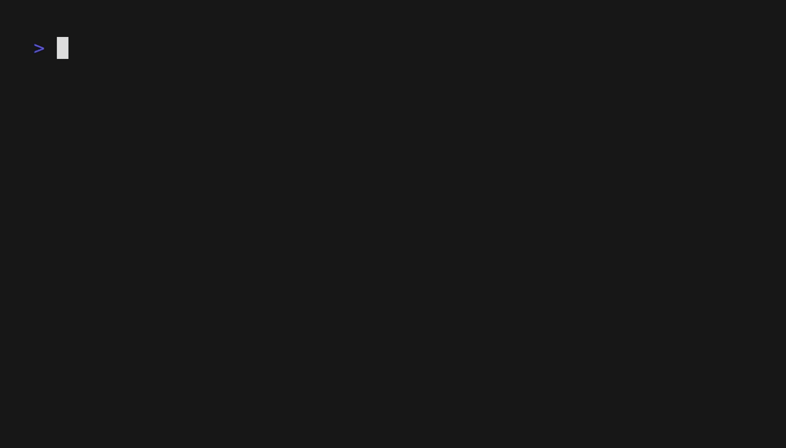
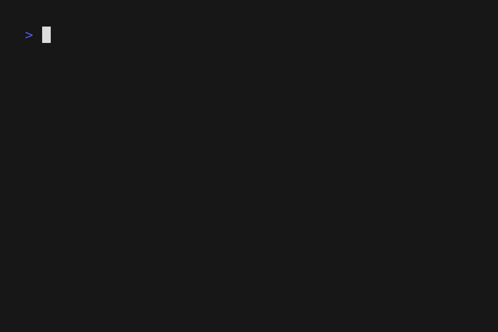

# Minepack

a tool for managing minecraft modpacks with ease

## Features

**export formats** - export to `.mrpack` (modrinth) (curseforge support coming soon:tm:)\
**instance linking** - sync your modpack to a minecraft instance to quickly test stuff\
**bisect search** - easily find which mods are causing issues with a built in bisection search tool- also considers dependencies so nothing should break.\
**dependency resolution** - automatically handles mod dependencies (unless the mod creator fails to add any)\
**version management** - track modpack versions

## Installation

### Quick Install (Recommended)

#### Linux / macOS

```bash
curl -fsSL https://raw.githubusercontent.com/ayeuhugyu/minepack/main/scripts/install.sh | bash
```

or using wget:

```bash
wget -qO- https://raw.githubusercontent.com/ayeuhugyu/minepack/main/scripts/install.sh | bash
```

this will automatically download the latest release for your platform and install it to `~/.local/bin`.

#### Windows

open powershell and run:

```powershell
irm https://raw.githubusercontent.com/ayeuhugyu/minepack/main/scripts/install.ps1 | iex
```

this will automatically download the latest release and install it to `%USERPROFILE%\.minepack\bin`, then add it to your PATH.

### Manual Download

download the latest release for your platform from [releases](https://github.com/ayeuhugyu/minepack/releases)

### Build from Source

```bash
git clone https://github.com/ayeuhugyu/minepack.git
cd minepack
go build -ldflags "-X minepack/util/version.Version=$(git describe --tags --always)"
```
(you will need to have the go language installed for this to work)

### Self-Update

keep minepack up to date automatically:

```bash
minepack selfupdate
```

## Quick Start

### 1. Initialize a new modpack


```bash
minepack init
```

### 2. Add mods



```bash
minepack add sodium
minepack add create
```

### 3. View information about your modpack


```bash
# list all mods in your modpack
minepack list

# view generic pack data
minepack stats
```

### 4. Export your modpack

```bash
# export as .mrpack
minepack export modrinth
```

## Advanced Usage

### Instance linking

link your modpack to Minecraft instances for automatic syncing / binary searches:


```bash
# add a linked instance
minepack link add /path/to/instance

# list all linked instances
minepack link list

# update all linked instances with current modpack
minepack link update

# filter updates by side or source
# (useful to download all server side only mods or vice versa)
minepack link update --server-only
minepack link update --client-only
minepack link update --source modrinth
```

### Troubleshoot with bisect searching



debug mod conflicts and crashes by systematically enabling/disabling mods:

```bash
# start bisect session for a linked instance
minepack link bisect /path/to/.minecraft

# get the next set of mods to test
minepack link bisect next

# get the next set of mods to test
# after the first time, it will ask the test results of the previous one (good|bad)
minepack link bisect next
# keep bisecting until you narrow it down to one mod that is causing problems

# finish bisection
minepack link bisect finish
```

### Version management

track your modpack versions:

```bash
# set version format (semver, breakver, increment, or custom)
minepack version format semver

# set initial version
minepack version set 1.0.0 -m "Initial release"

# increment versions
minepack version patch add 1  # 1.0.0 -> 1.0.1
minepack version minor add 1  # 1.0.1 -> 1.1.0
minepack version major add 1  # 1.1.0 -> 2.0.0

# show version history
minepack version show --history
```

#### Reverting to previous versions

revert your entire modpack to any previous version:


```bash
# revert to a specific version
minepack version revert 1.0.0

# your mods will be restored to that version's state
minepack list
```

(this is done using a local git repository)

## License

this project is licensed under the MIT License - see the [LICENSE](LICENSE) file for details.
